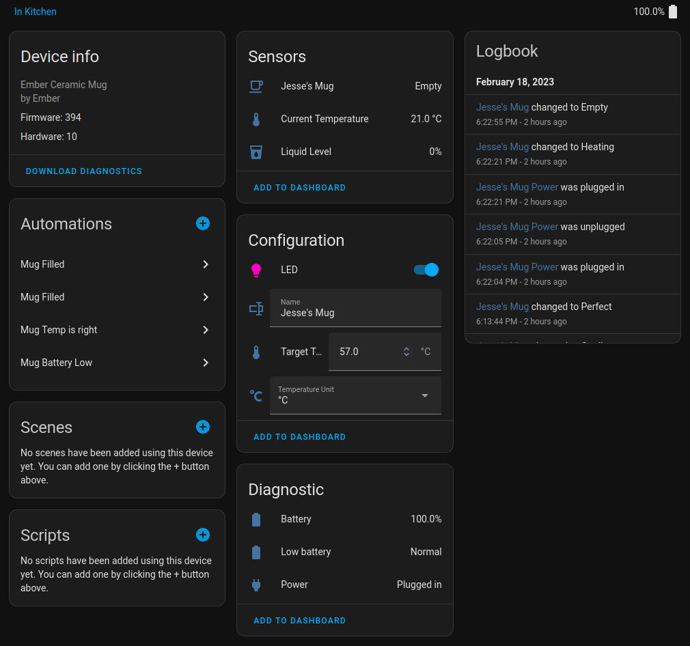
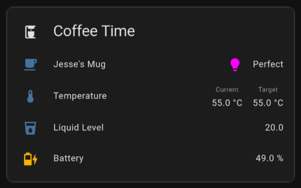

# [Ember Mug Integration for Home Assistant](https://github.com/sopelj/hass-ember-mug-component)

[](https://github.com/sopelj/hass-ember-mug-component/releases)
[](LICENSE.md)
[](https://github.com/hacs/integration)


**Important!**: 
The new Home Assistant 2022.8 introduces a new [Bluetooth Integration](https://www.home-assistant.io/integrations/bluetooth) which conflicts with this integration.
If version 0.3.X of this integration will work on 2022.8 as long as you to not configure the new Bluetooth integration and the new devices that use it. 
If you have configured it, you can delete it from Settings -> Services.
I am going to explore the new integration and see if I can rewrite this one to use it. However, in the meantime they are mutually exclusive.  



Custom integration for the Ember Mug in Home Assistant.
I only have the Ember Mug 2, but in theory it should be the same with other Ember Mugs.

The protocol is not public, so there is quite a bit of guesswork involved. 
[@orlopau](https://github.com/orlopau) did a great job documenting some [UUIDs here](https://github.com/orlopau/ember-mug) And had to attempt to extract the rest of them. 

I can't seem to get writing to attributes working yet, but reading the data works great.

## Installation / Setup

### Add Repository

Add to HACS as custom repository:

<https://github.com/sopelj/hass-ember-mug-component>

And then install "Ember Mug" integration.

### Preparing your Mug

The Ember Mug is very finicky. It will only maintain a connection with one device at a time. 
If you have previously paired it with another device (like your phone) you will need to forget it from that device and reset the mug to factory settings.

*Note*: This will mean you cannot use that device to connect to at the same time as Home Assistant, and it will default to initial temperature and colour settings.

To do so:
 1. Forget the Mug on ay device you previously used
 2. Hold down button on the bottom of the mug until light goes blue, then yellow anf then red 
 3. It should blink red twice and goes back to white (The default colour) 
 4. Then enter pairing mode again - Hold down the button until the light starts blinking blue
 5. Once home assistant successfully connects it should leave pairing mode and go back to white

### Setup in home assistant

1. Click here: [](https://my.home-assistant.io/redirect/config_flow_start/?domain=ember_mug)
2. Select MAC that was found and choose next.

*Or*

1. Go into Settings -> Devices 
2. Choose "Add Integration" 
3. Search for "Ember Mug"
4. Select MAC that was found and choose next.

*Note* If it fails to find your mug please try resetting and entering pairing mode again before trying again.

## Caveats / known issues:

- The services to change mug values fail with a bluetooth permission error, that I can't figure out yet. 
- If you have another device paired with it like your phone it will cause it to disconnect, so you need to remove it from that device.
- This maintains a connection to your mug which:
    - may affect battery
    - may interfere with other local bluetooth integrations as it can only maintain one connection at a time.
- Currently, it won't work with more than one mug


## Examples

### Automations:

If you want to have notifications similar to the app you can do something like:

*Note*: If you chose a different name for you mug the sensor names may be different.

```yaml
automation:
  - id: mug_filled
    alias: Mug Filled
    trigger:
      - platform: state
        entity_id: sensor.mug  # your mug entity
        from: "Empty"
        to:
          - "Filling"
          - "Heating"
          - "Cooling"
    action:
      service: notify.mobile_app_jesse_s_pixel_4a  # Mobile device notify or other action
      data:
        message: Your mug has been filled

  - id: mug_temp_right
    alias: Mug Temp is right
    trigger:
      - platform: state
        entity_id: sensor.mug
        attribute: liquid_state
        from:
          - "Heating"
          - "Cooling"
        to: "Perfect"
    action:
      service: notify.mobile_app_jesse_s_pixel_4a  # Mobile device notify or other action
      data_template:
        message: "Your mug is at the desired {{ states('sensor.mug_current_temp') }}{{ state_attr('sensor.mug_current_temp', 'unit_of_measurement') }}."

  - id: mug_battery_warning
    alias: Mug Battery Low
    trigger:
      - platform: numeric_state
        entity_id: sensor.mug_battery
        below: 20
        for:
          minutes: 10
    action:
      service: notify.mobile_app_jesse_s_pixel_4a  # Mobile device notify or other action
      data_template:
        message: "Your mug battery is low ({{ states('sensor.mug_battery') }}%)."

```

### Lovelace

An example for what I use in my lovelace config. 
This uses a couple custom lovelace cards, you could do something similar with base widgets, but I've used these here 
([battery-state-card](https://github.com/maxwroc/battery-state-card), [lovelace-multiple-entity-row](https://github.com/benct/lovelace-multiple-entity-row) and [stack-in-card](https://github.com/custom-cards/stack-in-card))



```yaml
type: custom:stack-in-card
cards:
  - type: entities
    icon: mdi:coffee
    title: Ember Mug
    show_header_toggle: false
    entities:
      - entity: sensor.mug_current_temp
        type: custom:multiple-entity-row
        name: Temperature
        show_state: false
        entities:
          - entity: sensor.mug
            name: State
          - entity: sensor.mug_current_temp
            name: Current
          - entity: sensor.mug_target_temp
            name: Target
      - type: custom:template-entity-row
        entity: sensor.mug_liquid_level
        name: Liquid Level
        unit: '%'
      - type: custom:battery-state-entity
        name: Battery
        entity: sensor.mug_battery
        charging_state:
          attribute:
            name: battery_charging
            value: true
```
